# Detecção e Bloqueio de Rastreadores no Firefox

**Avaliação Intermediária — Cibersegurança — Insper**
Rafael Ken Reis Miyamoto · https://github.com/rafa-ken/tracker-detector

---

## 1. A ferramenta

Extensão MV2 para Firefox que observa uma navegação e reporta, por aba, as
técnicas de rastreamento empregadas. `background.js` observa `webRequest`
(requisições, redirects e cabeçalhos), consulta o cookie jar e aplica o
bloqueio; `content.js` roda em `document_start` em todos os quadros e instala os
hooks de canvas no contexto da página via `wrappedJSObject` e `exportFunction`;
`score.js` calcula a pontuação; `popup` e `options` formam a interface.

Dois pontos de implementação que importam para a leitura dos resultados:

**Cookies são medidos de duas formas.** *Injetados no carregamento*, lidos dos
cabeçalhos `Set-Cookie` em `onHeadersReceived`, e *presentes no cookie jar*, via
`browser.cookies` incluindo consulta por `partitionKey`. Só a primeira entra na
nota. A separação foi necessária: medindo apenas o jar, o Insper reportava 92
cookies de terceira parte persistentes, inflados por navegações anteriores a
outros sites, e todo site saturava a nota.

**Bounce é detectado por tempo de permanência.** O `bad.third-party.site` do DDG
não usa redirect HTTP, e sim navegação por JavaScript, invisível ao
`onBeforeRedirect`. A extensão mantém o histórico do documento principal e
classifica como salto a página de domínio distinto com permanência inferior a
1500 ms, percorrendo de trás para frente e parando no primeiro salto que não
qualifica.

## 2. Condições do experimento

Firefox 156.0.1, Windows, ETP no nível padrão e Total Cookie Protection ativo.
A lista de bloqueio da extensão ficou **desativada** durante toda a coleta, e o
uBlock Origin foi instalado **somente depois** dos HAR e dos relatórios do
plugin — instalado antes, suprimiria requisições e contaminaria a medição.

Isso condiciona todos os números: o que a extensão observa é o resultado *depois*
das defesas nativas do Firefox. O Blacklight, que roda sem elas, vê bem mais.

---

## 3. Entregável 2 — DuckDuckGo Privacy Test Pages

| # | Teste | Esperado (reportado pela página) | Resultado do plugin |
|---|---|---|---|
| 1 | Tracker Reporting | Carrega um rastreador via `<script src>` | 1 domínio de 3ª parte (`doubleclick.net`); 1 hijack (script injetado); 95 (A) |
| 2 | Request Blocking, lista off | Todos os tipos carregam; só `websocket` falhou | 1 terceiro; 0 bloqueios; 2 hijack (WebSocket + script); 92 (A) |
| 3 | Request Blocking, lista on | Requisições a `bad.third-party.site` não carregam | 22 requisições bloqueadas; hijack cai para 1; 95 (A) |
| 4 | Storage blocking | Gravou e recuperou `"771"` em 23 mecanismos | 3 terceiros; 9 cookies injetados (8 de 3ª parte persistentes); storage 3; 67 (B) |
| 5 | Storage partitioning | Cookies **fail**, APIs HTML5 **pass** | 7 cookies no jar **sem** marca de particionado; 97 (A) |
| 6 | Fingerprinting | 124 datapoints coletados | Só canvas detectado; 0 terceiros; 85 (A) |
| 7 | Canvas | Dois checks de *resistance* falharam | Canvas detectado; 1 terceiro (`cdnjs`); 79 (B) |
| 8 | Query parameters | `Expected: "q=other"` | URL chegou com `utm_source`; plugin detectou; 98 (A) |
| 9 | Bounce tracking | UID `"37"` repassado ao destino via parâmetro | 1 salto; 2 correspondências de sync com valor `37`; 80 (A) |
| 10 | js-leaks | *Changed*: só `languages`, `location.toString`, `location.valueOf` | Nenhum hijack; 100 (A) |

### Explicação das divergências

**2 — a página marca `websocket` como falho, o plugin registra a tentativa.** O
`webRequest` observa a requisição quando é emitida, antes do handshake. O que
interessa ao indicador é a intenção de abrir canal persistente com terceiro.

**3 — o bloqueio reduz o hijack de 2 para 1.** O `onBeforeRequest` cancela antes
da linha que registra o tipo `websocket`; já o script injetado continua sendo
visto pelo `MutationObserver`, porque o `<script>` entra no DOM mesmo com a
requisição cancelada. Disso decorre uma ressalva: **o bloqueio melhora a nota em
parte porque remove a evidência, não só a ameaça.**

**4 — 23 mecanismos gravados, 3 contabilizados.** A página grava também dentro
de iframes de terceiros; a consulta usa `{ frameId: 0 }` e só interroga o quadro
principal. Os cookies, esses, vêm completos: os 8 de terceira parte persistentes
correspondem aos `*_headerdata` que a página reporta.

**5 — o plugin corrobora só a parte de cookies.** Os cookies de
`privacy-test-pages.site` voltaram da consulta por domínio **sem**
`partitionKey`, consistente com o **fail** da página; compare com o teste 4, em
que vieram marcados como particionados. Para `localStorage` e `IndexedDB` o
plugin não tem como opinar: a API não expõe se estão particionados.

**6 — 124 datapoints, um detectado.** A extensão só instrumenta canvas.
`navigator`, `screen`, WebGL, AudioContext e fontes passam. Uma página que faz
fingerprinting extensivo em primeira parte, sem terceiros, recebe A.

**7 — verdadeiro positivo em comportamento, falso positivo em intenção.** A
página lê pixels de canvas para conferir conformidade de renderização, não para
rastrear. A extensão não distingue os dois usos.

**8 — a divergência é do navegador.** O `utm_source` sobreviveu porque a limpeza
de parâmetros do Firefox só atua no ETP Strict e na navegação privativa. O
plugin é o que evidencia isso.

**9 — a unidade de análise é o site registrável, não o host.** O mesmo teste com
destino `good.third-party.site` não reporta nada e classifica o `bounceUID` como
primeira parte, porque `bad.` e `good.third-party.site` compartilham o domínio
registrável `third-party.site`. Não há travessia entre partes, e o próprio Total
Cookie Protection os trata como uma partição só.

**10 — a js-leaks não vê os hooks da própria extensão.** A varredura percorre
propriedades enumeráveis de `window`; os métodos substituídos vivem em
`HTMLCanvasElement.prototype` e `CanvasRenderingContext2D.prototype`, que são
não-enumeráveis. O ponto cego é justamente o hook de protótipo, a forma mais
comum de instrumentar fingerprinting.

### Defeitos corrigidos durante a coleta

- **Limiar de bounce.** Com 7000 ms, dois cliques deliberados (2542 ms e 1866
  ms) foram classificados como bounce. Reduzido para 1500 ms, separou os casos.
- **Bounce residual.** A varredura analisava os últimos quatro registros do
  histórico independentemente de levarem à página atual, e o salto da página
  anterior contaminava a seguinte. Passou a parar no primeiro salto inválido.
- **Identificadores curtos.** O mínimo de 8 caracteres descartava o UID `"37"`.
  Passou a aceitar valores curtos quando o nome do parâmetro sugere identificador.

### Prints

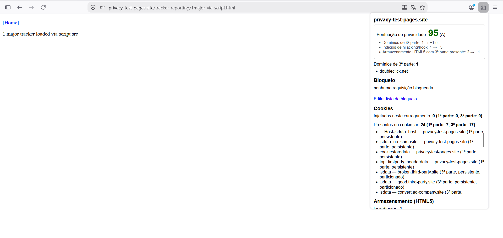
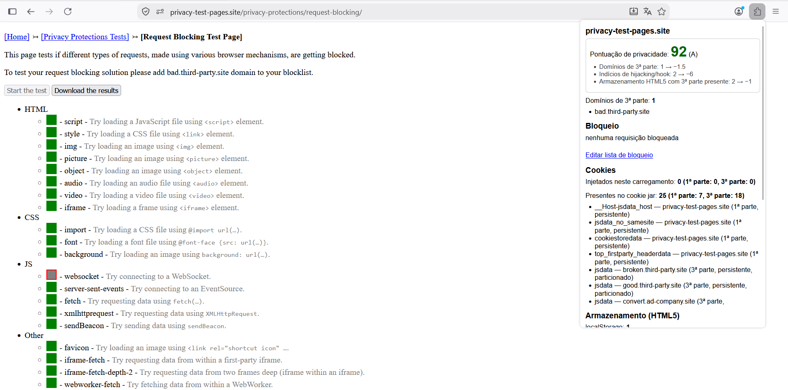
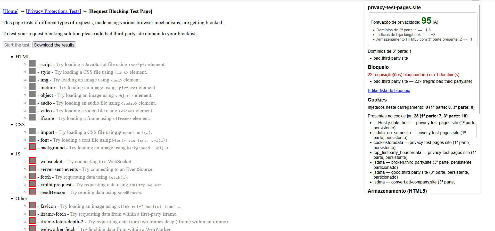
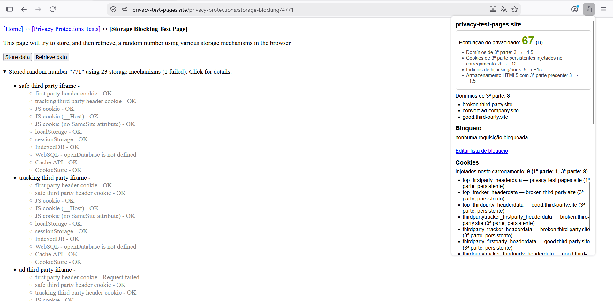
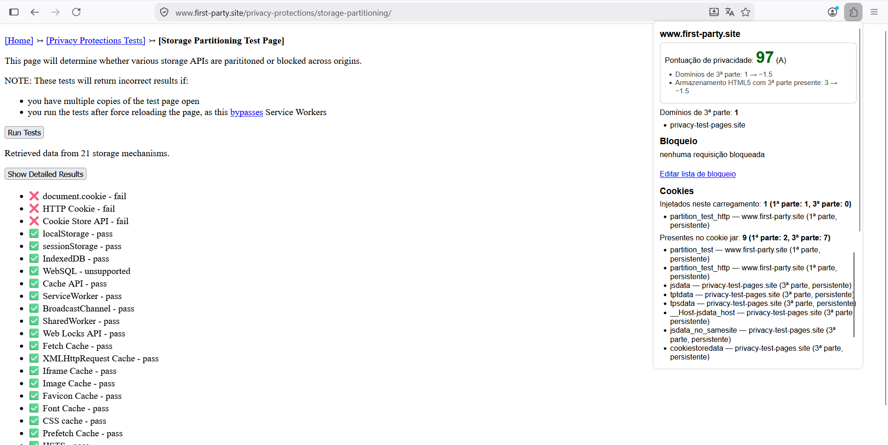
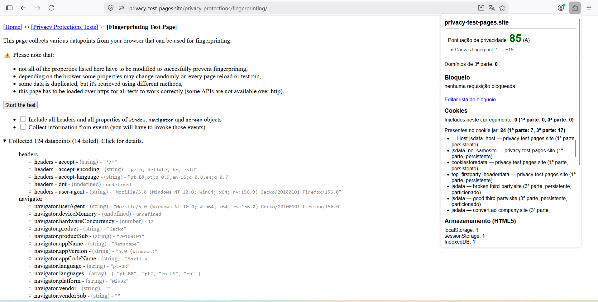
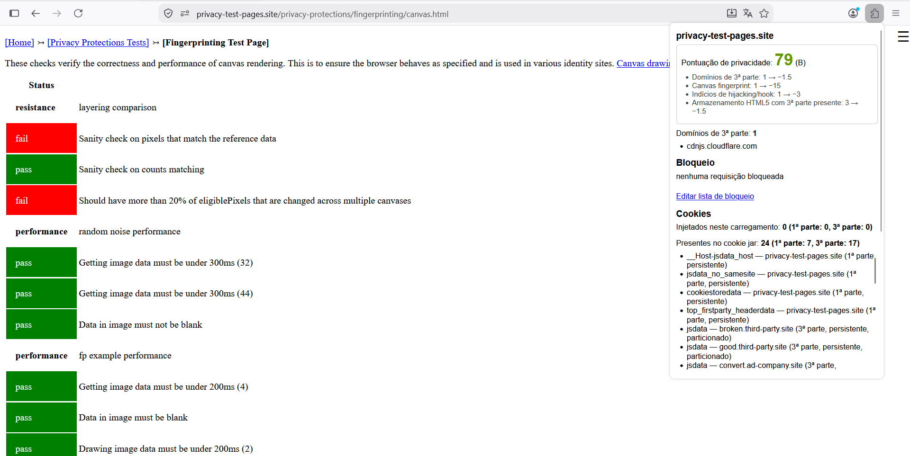
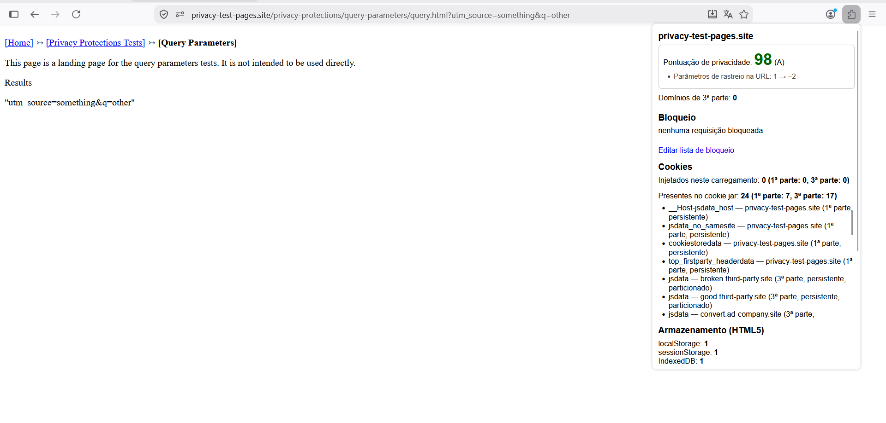
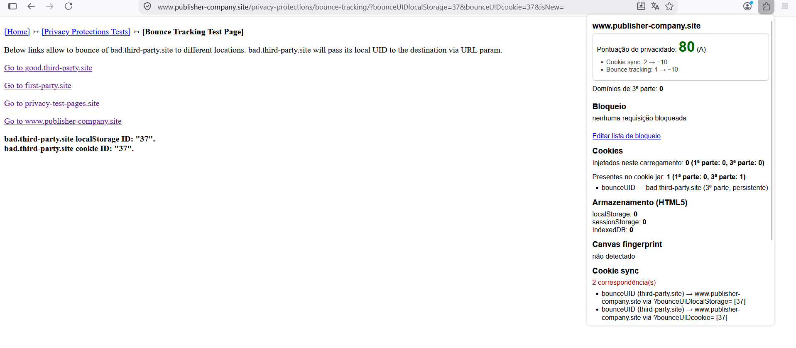
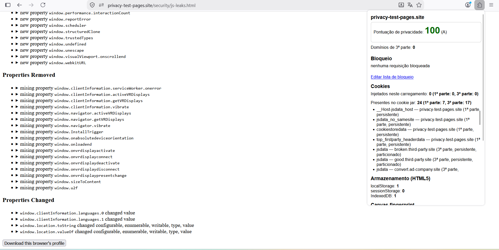

---

## 4. Entregável 3 — Três sites reais

Referências "entrada #N" apontam para o índice da requisição nos HAR em
`evidencias/sites/`, exportados no mesmo carregamento dos prints.

| | `www.gov.br` | `www.insper.edu.br` | `g1.globo.com` |
|---|---|---|---|
| **HAR** — entradas | 109 | 208 | 306 |
| Hosts de 3ª parte | 9 | 42 | 61 |
| Cookies únicos / 3ª parte persistentes | 1 / 0 | 11 / 10 | 16 / 11 |
| **Blacklight** — ad trackers | 1 | 15 | 68 |
| Cookies de 3ª parte | 0 | 29 | 85 |
| Session recording | não | **sim** | não |
| Facebook / TikTok / X | — | **sim / sim** / — | — / — / **sim** |
| **uBlock** — requisições bloqueadas | 5 | 15 | 54 |
| Domínios conectados | 9 de 12 | 12 de 20 | **6 de 24** |
| **Score do plugin** | **79 (B)** | **11 (F)** | **15 (F)** |

Os 42 hosts de terceira parte do HAR do Insper coincidem exatamente com o que o
popup reportou, o que valida a coleta por `webRequest`.

### Reconciliação

| Caso | Blacklight | uBlock | Plugin | Explicação com referência ao HAR |
|---|---|---|---|---|
| `googletagmanager.com` (gov.br) | único ad tracker | bloqueado | 3ª parte | Entrada #88. As três concordam. |
| `go-mpulse.net`, `browser-update.org` (gov.br) | não contam | **bloqueados** | 3ª parte | Entradas #98, #105, #92. Telemetria de desempenho e verificação de versão: a EasyPrivacy bloqueia, o Blacklight não considera publicidade. Divergência de critério, não de fato. |
| `sistema.gov.br`, `vlibras.gov.br` | não contam | permitidos | 3ª parte | Entradas #43 e #46. Serviços do próprio governo; domínios registráveis distintos de `www.gov.br`. |
| Hotjar (Insper) | **session recording** | não bloqueado | só host de 3ª parte | Entrada #48 (`hotjar-4345824.js`). A extensão não mantém lista de fornecedores nem instrumenta captura de interação. |
| Microsoft Clarity (Insper) | **session recording** | bloqueado | só host de 3ª parte | `clarity.js` na entrada #119 e dez POSTs a `g.clarity.ms/collect` desde a entrada #2. |
| TikTok, LinkedIn (Insper) | TikTok **sim** | **ausentes da lista** | 8 e 3 requisições | Pixel do TikTok nas entradas #50 e #52, cookie `_ttp` na #50; LinkedIn nas #171 e #173. Somem do uBlock por **efeito cascata**: quem os carregava era o `googletagmanager.com` (#17), que foi bloqueado. |
| HubSpot (Insper) | entre os ad trackers | 4 de 6 bloqueados | 6 domínios distintos | Entradas #5, #122, #123, #124, #125, #170. Uma empresa, seis domínios registráveis, seis terceiros para o plugin. |
| **Canvas (Insper)** | **não encontrado** | — | **detectado** | O plugin sinaliza qualquer chamada a `toDataURL`/`getImageData`/`fillText`; o Blacklight exige o padrão de fingerprinting (texto com fontes variadas em canvas não exibido). Clarity e o pixel do TikTok usam canvas para outros fins. |
| `glbimg.com`, `g.globo`, `cloud.globo` (g1) | não contam | **permitidos** | 78 requisições como 3ª parte | Entradas #1, #10, #24, #67, #90, #112. `s3.glbimg.com` sozinho tem 63 requisições, o host mais frequente do HAR. É a CDN da Globo; as duas referências usam lista de entidades, o plugin não. **Principal fonte de inflação.** |
| DoubleVerify (g1) | ad tracker | bloqueado | sync entre domínios | `pub.doubleverify.com` (#167) e `vtrk.dv.tech` (#207) compartilham `27566431` e `DV1036776`. Mesma empresa, domínios distintos. |
| `globoi.com` (g1) | não conta | **bloqueado** | 3ª parte | Entrada #20 (`sentry.globoi.com`). O uBlock bloqueia um domínio do próprio grupo enquanto permite `glbimg.com`: listas de entidade não são aplicadas uniformemente. |
| **Cookies de 3ª parte** | 29 e 85 | — | 10 e 11 no HAR | Três causas somadas, abaixo. |

**Os 85 contra 11 cookies do g1.** (i) O Blacklight roda em navegador headless
sem ETP e sem Total Cookie Protection; no Firefox do experimento boa parte dos
rastreadores é bloqueada antes de responder e o resto é particionado. (ii) O
plugin lê `Set-Cookie`; cookies gravados via `document.cookie` não entram, e o
Blacklight inspeciona o jar ao final e vê os dois tipos. (iii) Seis dos dez
cookies do Insper são `__cf_bm` do Cloudflare, com validade de 30 minutos: numa
visita dentro desse intervalo o servidor não reemite o cabeçalho. É o que
explica os 6 do popup contra os 10 do HAR — **a injeção de cookies não é
idempotente entre carregamentos.**

### Achado exclusivo — identificador da Globo enviado ao Google

O valor `179048154389902012127318` aparece como `up.user_code` e
`ep.user_code_hit` em requisições a `ab.g.globo` (entradas #105 e #111) e como
`userId` em requisição a `analytics.google.com` (entrada #178). Um identificador
gerado pela própria Globo chega ao Google Analytics.

Nem o Blacklight nem o uBlock reportam isso: um classifica por categoria de
rastreador, o outro bloqueia por lista de domínios. A detecção exige
correlacionar **valores** entre requisições a hosts distintos, que é o critério
de cookie sync da extensão.

### Efeito cascata

Com a lista própria ativada no g1, quatro requisições bloqueadas
(`googletagmanager`, `securepubads.g.doubleclick`, `scorecardresearch`,
`ads.rubiconproject`) derrubaram os domínios de terceira parte de **112 para 18**
e os cookies de terceira parte injetados de **56 para 0**. O uBlock reproduz em
escala maior: 54 requisições bloqueadas, 6 de 24 domínios conectados. O
rastreamento depende de poucos pontos de entrada.

### Prints

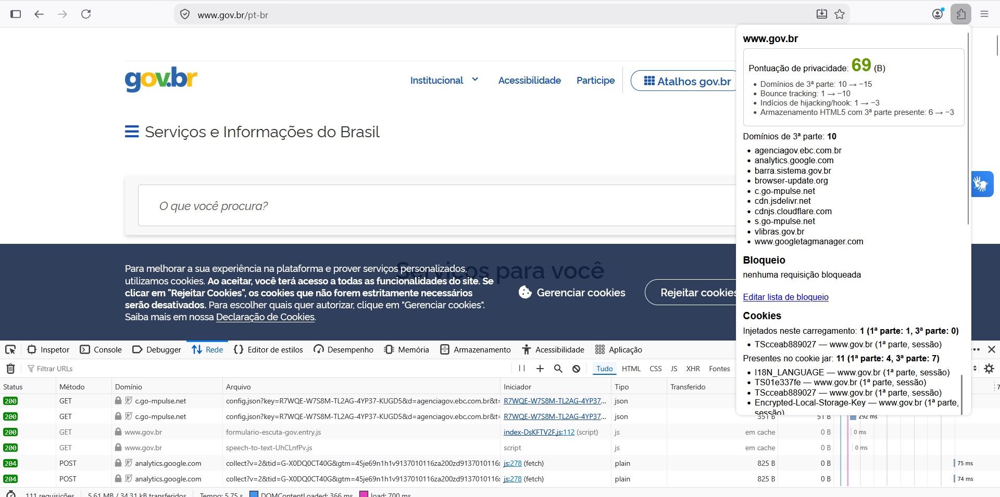
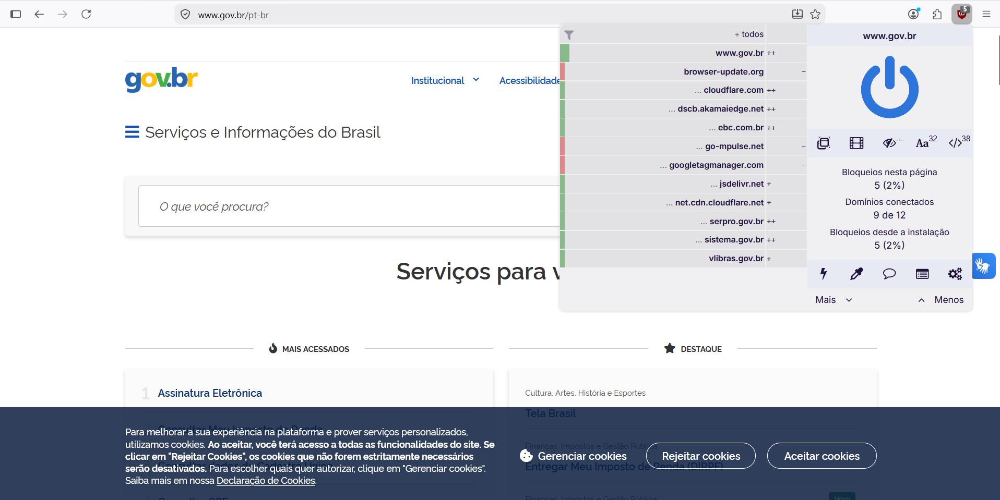
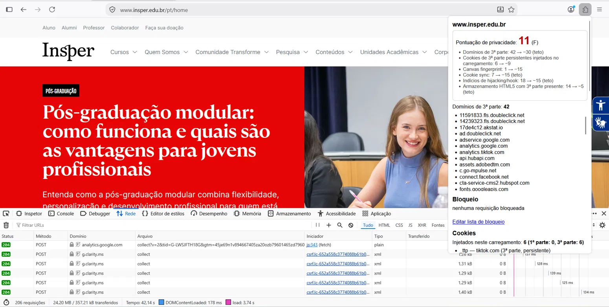
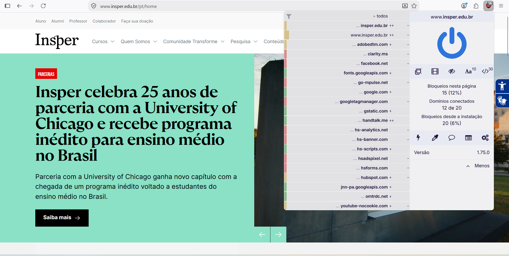
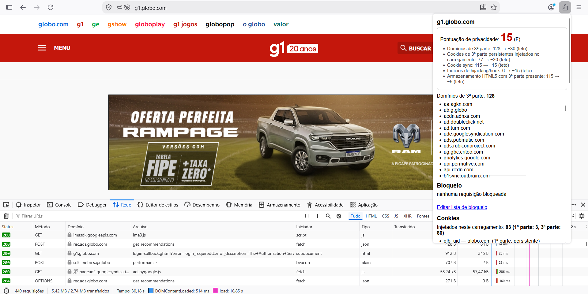
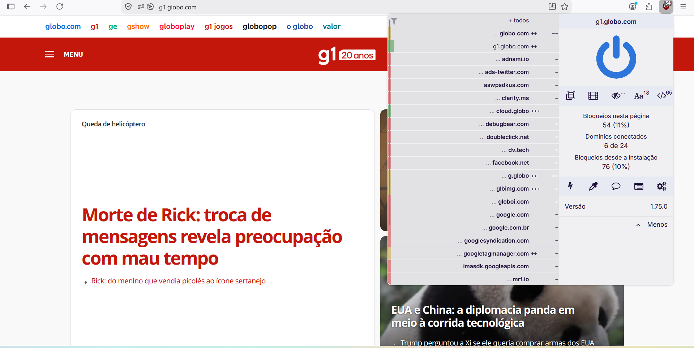

HAR: `evidencias/sites/gov.har`, `insper.har`, `g1.har`.

---

## 5. Entregável 4 — Pontuação de privacidade

Critérios, pesos e justificativas em `docs/METODOLOGIA.md`. Resultados: **gov.br
79 (B)**, **Insper 11 (F)**, **g1 15 (F)**.

**Onde concorda com o Blacklight.** A ordenação dos três sites é idêntica: 1, 15
e 68 ad trackers contra 79, 11 e 15 pontos. Convergência nominal em TikTok e
Facebook no Insper e em X no g1.

**Onde o plugin vê mais.** Cookie sync, bounce tracking e hijacking não constam
do Blacklight. O caso mais significativo é o identificador da Globo repassado ao
Google Analytics.

**Onde o Blacklight vê mais.** Session recording e keystroke capture. No Insper
isso significa deixar passar Hotjar e Clarity, cuja função é gravar o
comportamento do usuário — mais invasivo que boa parte dos rastreadores
publicitários contados. É a maior lacuna da ferramenta.

**Por que os números não são comparáveis.** O Blacklight mede em navegador limpo
sem proteções e sem interagir com banners de consentimento; a extensão mede no
navegador real com ETP ativo. O viés tem direções opostas conforme o indicador.

**Limitações da escala.** Insper (11) e g1 (15) ficam próximos apesar de perfis
diferentes, porque ambos saturam os tetos de cinco critérios: a escala perde
resolução abaixo de 20. E a página de bounce do DDG, que executa bounce e cookie
sync deliberadamente, recebeu **80 (A)** — técnicas intencionais de contorno
deveriam pesar mais que indicadores de volume.

---

## 6. Limitações da ferramenta

1. Domínio registrável por heurística, sem lista de sufixos públicos.
2. **Sem lista de entidades**: 78 das requisições de "terceiros" do g1 são da CDN
   da própria Globo.
3. Armazenamento medido só no quadro principal (`frameId: 0`).
4. Fingerprinting restrito a canvas; `navigator`, `screen`, WebGL e fontes não
   são instrumentados.
5. Sem detecção de session recording nem keystroke capture.
6. `OffscreenCanvas` e Web Workers fora do alcance do content script.
7. Cookies gravados via `document.cookie` não entram na métrica de injetados.
8. Não distingue uso legítimo de canvas de fingerprinting.
9. A extensão altera protótipos da página e é, em princípio, detectável — o
   mesmo risco de extensões descrito na introdução do enunciado.

## 7. Conclusão

A ferramenta detecta o que se propôs e, em dois pontos, supera as referências:
identifica cookie sync e bounce tracking, ausentes do Blacklight e do uBlock, e
flagrou um identificador de primeira parte da Globo sendo repassado ao Google
Analytics — achado que depende de correlacionar valores entre requisições, não
de reconhecer domínios numa lista.

A comparação expôs duas fraquezas estruturais: a ausência de lista de entidades,
que faz a CDN da Globo responder por 78 das requisições classificadas como
terceira parte, e a superfície de detecção restrita, que deixa passar Hotjar e
Clarity como simples conexões.

O trabalho também deixou claro que **medir privacidade depende tanto do ambiente
quanto do site**. Os 85 cookies de terceira parte que o Blacklight atribui ao g1
contra os 11 observados localmente não indicam erro de nenhum dos dois: indicam
que o ETP e o Total Cookie Protection eliminam a maior parte do rastreamento
antes que ele se concretize. Uma pontuação de privacidade mede exposição
residual naquele navegador, e não a intenção do site.